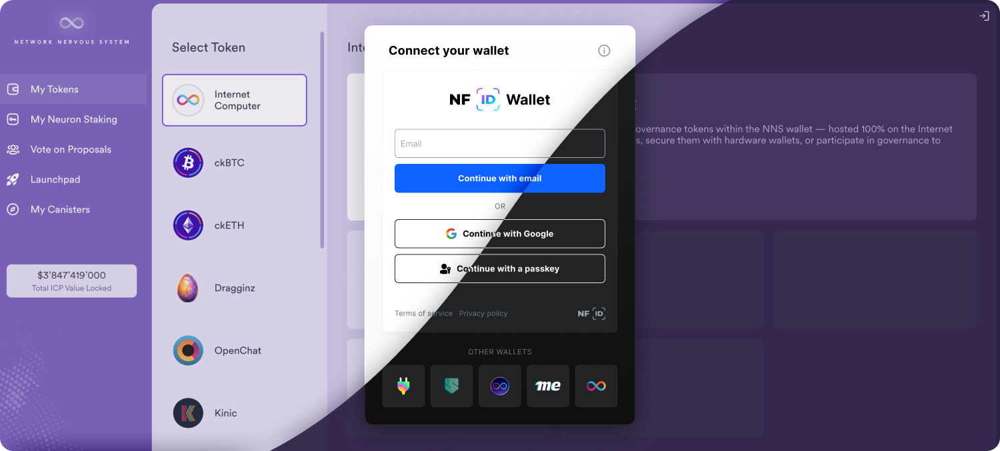

# The ICP Wallet Standards Series - Overview

The Internet Computer Protocol (ICP) has emerged as a pivotal force in decentralized applications,
with its rapid evolution and diverse applications ranging from Bitcoin marketplaces to music
streaming platforms. This dynamic growth has reshaped how we interact with decentralized systems,
significantly reducing reliance on centralized infrastructure and leveraging the inherent security
of the protocol itself. However, authentication and wallet support has been a constant challenge.

## What are these standards for?

Developers building on the Internet Computer have encountered significant challenges in
accommodating the wide range of wallet and identity options available (i.e. NFID, Internet Identity,
Plug, Stoic, Me, etc). This difficulty primarily arises from the need to adapt to each wallet's
unique interfaces for user authentication, token transfers, and other identity-related interactions,
leading to compatibility issues and delays in development.

With DFINITY's support, the NFID team will release the open-source tool `@nfid/identitykit`, to
resolve those challenges. This package will enable developers to incorporate a broad spectrum of
functionalities, paving the way for a more interconnected and efficient application environment.

## Exploring the Different ICP Wallet Standards

### ICRC-25 Base Signer Interaction Standard

This standard outlines a foundational protocol for communication between decentralized apps (dApps)
and signers. It specifies a set of messages to facilitate this interaction, ensuring a seamless and
secure exchange of information. The `ICRC-25` aims to create a uniform language for apps and
signers, enhancing interoperability and simplifying development.

[Technical draft](../identity-kit/icrc-25-signer-interaction-standard)

### ICRC-31 Get Principals

It defines the `icrc31_get_principals` method, which plays a crucial role in identity management. It
allows applications to retrieve information about the identities a signer manages, streamlining the
authentication process. This standard is pivotal in ensuring that users can manage their digital
identities efficiently and securely.

[Technical draft](../identity-kit/icrc-31-get-principals)

### ICRC-32 Sign Challenge

The `icrc32_sign_challenge` method defines a secure mechanism for verifying ownership of user
identities. By facilitating cryptographic proofs, this standard strengthens the security framework
of applications, ensuring that user identities are protected and authenticated reliably.

[Technical draft](../identity-kit/icrc-32-sign-challenge)

### ICRC-49 Call Canister

This standard allows applications to request the execution of calls to third-party canisters by the
signer. Using the `icrc49_call_canister` method, applications can interact with a broader range of
services and functionalities, enhancing the versatility and reach of ICP-based applications.

[Technical draft](../identity-kit/icrc-49-call-canister)

### ICRC-34 Get Delegation

The `icrc34_get_delegation` method is designed to facilitate the delegation of identity management.
This process allows users to manage their identities and permissions securely, providing a flexible
and secure framework for identity delegation within the ICP ecosystem.

[Technical draft](../identity-kit/icrc-34-get-delegation)

## What's next

As each standard goes through the community review process and final approval, this post will be
updated with statuses and links to technical implementation details, including code snippets and UX
configuration.

## Collaborate with us!

These standards are currently under development, and we encourage the ICP community to actively
participate in finalizing them. The development process has been transparent and collaborative
within the
[Identity and Wallet Standard Working Group](https://github.com/dfinity/wg-identity-authentication),
which meets publicly every two weeks, foundational work by Papers/AirGap, and primarily the work of
[@IdentityMaxis](https://twitter.com/IdentityMaxis) (NFID Team) and DFINITY, with support from
[@sea-snake](https://github.com/sea-snake) and other individual community members.

- [Identity and Wallet Standard Working Group](https://github.com/dfinity/wg-identity-authentication)
- [Identity & Authentication DFINITY Forum](https://forum.dfinity.org/t/technical-working-group-identity-authentication)
- [Source Code for `@nfid/identitykit`](https://github.com/internet-identity-labs/nfid)
