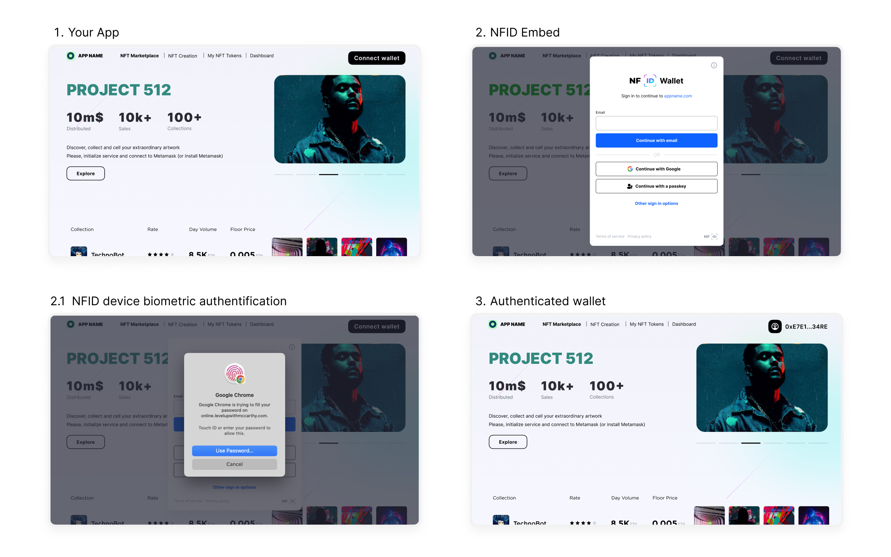

## Introduction

NFID is a set of smart contracts on the Internet Computer where users create identities and store
GBs of tamper-resistant, encrypted data. The current phase of development is to make self-sovereign
private key management feel like a web2 experience. NFID achieves this with the Internet Computer's
smart contracts and cryptographic primitives, allowing the generation of powerful, self-sovereign
`delegation identities` that can make authenticated smart contract calls without user approval
prompts and encrypt/decrypt their own data.

The NFID protocol currently allows users to:

- Manage private keys and their assets on ICP (Internet Computer Protocol)
- Sign in using an email address or one out of a set of passkeys (when 2FA is enabled)
- Authenticate to client (3rd party) applications

### Functional Requirements

- Users have one identifier for each supported network, with the option to extend with app and
  stealth addresses
- These identities are stable (i.e., do not depend on the email or passkey from which the user
  authenticated)
- Users do not need to remember secret information
- Clients can use the user's identity (`client delegation`) to interact with their own smart
  contracts (canisters), look up balances, and are otherwise enforced to request user approval
- Each `client delegation` has a session duration during which it can make authenticated calls
- Non-ICP clients (i.e., EVM dapps) can use the user's identity (`provider`) to look up balances and
  request signatures

### Security Requirements

- Email addresses are private to users, never to be exposed without user consent
- `Client delegations` handed out to client applications by NFID must be targeted with the frontend
  application's canisters only
- Private keys cannot be reconstructed without user authentication
- Users cannot authenticate without a passkey if 2FA is enabled, and otherwise without a Google
  token or opening a magic link

### Security Assumptions

- The delivery of frontend applications is secure. In particular, a user accessing NFID through a
  TLS-secured HTTP connection cannot be tricked into running another web application.
- Passkeys are trustworthy
- The user's browser is trustworthy

## The NFID Identity (NFIDentity)

- A user account is identified by a unique NFIDentity, a natural number chosen by the smart
  contract.
- A user has one address for each network (same across EVM).
- When a user authenticates to non-ICP network applications, the returned identity is a `provider`.
- When a user authenticates to ICP network applications, the returned identity is a
  [self-authenticating id](https://internetcomputer.org/docs/current/references/ic-interface-spec#id-classes)
  of the
  [DER encoded canister signature public key](https://internetcomputer.org/docs/current/references/ic-interface-spec/#canister-signatures)
  which has the form:

      ```plaintext
      user_id = SHA-224(DER encoded public key) · 0x02` (29 bytes)
      ```

> See more detailed information on [public key encoding and signatures](signatures).

The NFID Identity Manager smart contract stores a set of _device information_ in user accounts,
indexed by the respective NFIDentity, consisting of:

- the device's public key (DER-encoded)
- a device alias, matched by AAGUID (Authenticator Attestation Global Unique Identifier) and
  editable by the user, to recognize the device
- an optional credential ID, which is necessary for WebAuthn authentication

## NFID User Flow with Your Application

Users authenticate using email (or FIDO-based device biometrics for returning users with 2FA
enabled).

1. User initiates login on your site.
2. User authenticates to their NFID and provides a network address (or delegation identity in the
   case of ICP)
3. When your application requests a signature, the NFID iframe reappears for user approval.



## The Node Network

As of January 2024, the base protocol consists of
[559 (live) nodes](https://dashboard.internetcomputer.org/nodes) run by
[119 (live) node providers](https://dashboard.internetcomputer.org/providers) across
[105 (live) geographically distributed data centers](https://dashboard.internetcomputer.org/centers).
