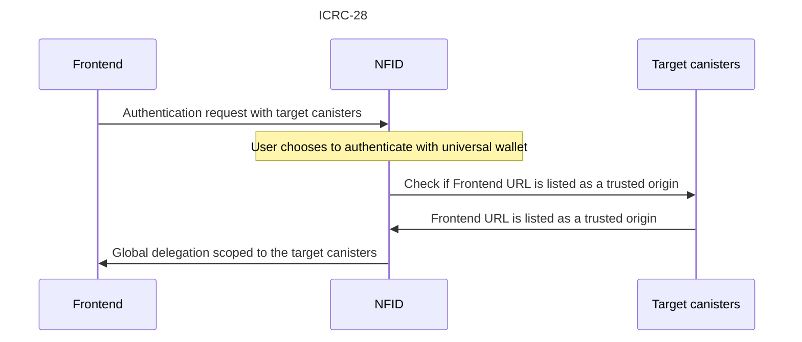

## Working with the NFID Wallet

[ICRC-28](https://github.com/dfinity/ICRC/issues/32) enables wallets to return same-principal
delegations to different applications. These delegations grant authenticated smart contract canister
access without requiring wallet prompts. It's crucial that these delegations are limited to specific
canisters controlled by the application. Failing to do so is an open invitation for malicious
applications to make unauthorized updates to any ICP canister, including ledger, governance, assets,
and other data.

If you aim to streamline your decentralized finance (DeFi) operations, such as checking wallet
balances and initiating transfers, it's imperative to support ICRC-28.

One of blockchain's main strengths lies in its composability, allowing developers to build on
existing smart contracts. However, without ICRC-28, other developers won't know which users are
utilizing your smart contracts, making collaboration and integration more challenging. **This is one
of the reasons we highly recommend implementing ICRC-28.**

If your sole requirement is an anonymous delegation for user sign-ins, and you don't prioritize
composability, you can disregard the following sections

### ICRC-28 Implementation

At a high level, this specification defines:

1. How a frontend makes an authentication request with target canisters
2. How the wallet checks if each target canister listed the frontend URL as a trusted origin



The below Rust code is a sample implementation of step 2 in the ICRC-28 spec (the only step you need
to implement when using the NFID SDK). Each of your canisters that the delegation should be able to
call without a wallet prompt should have this method implemented:

```rust
#[update]
async fn get_trusted_origins() -> Vec<String> {
    vec![
        // Origins should be in the format defined by the Window.postMessage method (https://developer.mozilla.org/en-US/docs/Web/API/Window/postMessage#the_dispatched_event)
        String::from("https://yoururl.com") // to be replaced with your frontend origin(s)
    ]
}
```

### Update Global Delegation

In case you need to update your targets, whether because you need to add another or to extend the
delegation's expiration time, you can use the `nfid.updateGlobalDelegation()` method:

```tsx copy
import { Identity } from "@dfinity/agent"

const delegationIdentity: Identity = await nfid.updateGlobalDelegation({
  targets: ["YOUR_CANISTER_ID_1", "YOUR_CANISTER_ID_2", "YOUR_CANISTER_ID_USER_SPECIFIC"],
})
```

### Request Fungible Token Transfer

The `nfid.requestTransferFT()` method requests approval to transfer the given amount of ICP from the
user to the designated address.

```tsx copy
type Response = {
  hash: string // the transaction hash
}

const response: Response = await nfid.requestTransferFT({
  receiver, // the receiver address
  amount, // the amount to transfer
})
```

### Request NFT Transfer

The `nfid.requestTransferNFT()` method requests approval to transfer an EXT NFT from the user to a
designated address.

```tsx copy
type Response = {
  hash: string // the transaction hash
}

const response: Response = await nfid.requestTransferFT({
  receiver, // the receiver address
  amount, // the amount to transfer
})
```

### Request Canister Call

The `nfid.requestCanisterCall()` method requests approval to call another canister with the given
`canisterId`, `method`, and `parameters` and return the response data.

```tsx copy
type Response = unknown // whatever the canister method returns

const response: Response = await nfid.requestCanisterCall({
  canisterId, // the canister id which will be called
  method, // the method on the canister which will be called
  parameters, // the parameters passed to the method on the canister
})
```
