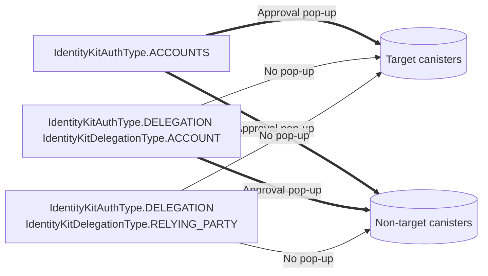

import { Callout } from "nextra/components"

# Executing canister calls

Your application will likely execute calls to your own canisters
([targets](/getting-started/installation#wrap-provider)) and others (non-targets i.e. ledger
canisters).

The following guide teaches you how to set up actors to each depending on how the user
authenticated, whether the canister is a target, and if the method being called requires a user to
execute.

## Steps

### 1. Connect Wallet

Follow the [installation](/getting-started/installation) guide to connect a wallet address.

### 2. Import idlFactories

You'll need an idlFactory for each canister you want to call.

```typescript
// import the idlFactory for your canister that implements icrc28_trusted_origins
import { idlFactory as targetIdlFactory } from "/path/to/target/did.js"

// import the idlFactory of another canister (i.e. ICRC-1 token ledger)
import { idlFactory as nonTargetIdlFactory } from "/path/to/nontarget/did.js"
```

### 3. Set up agents

IdentityKit comes bundled with a [hook](/hooks/useAgent) to get the agent for making authenticated
calls to target and non target canisters, and manages whether or not to show approval pop-ups. You
should also set up an unauthenticatedAgent for calls the user doesn't need to execute themselves.

```typescript
import { useAgent } from "@nfid/identitykit/react"
import { HttpAgent } from "@dfinity/agent"
import { useEffect } from "react"

const ICP_API_HOST = "https://icp-api.io/"

// Use an unauthenticatedAgent (aka anonymous agent)
// when the user doesn't need to execute the call themselves.
const [unauthenticatedAgent, setUnauthenticatedAgent] = useState<HttpAgent | undefined>()

useEffect(() => {
  HttpAgent.create({ host: ICP_API_HOST }).then(setUnauthenticatedAgent)
}, [])

// Use an authenticatedAgent when making authenticated calls.
// A wallet approval pop-up will be displayed if necessary.
const authenticatedAgent = useAgent()
```

<Callout type="warning" emoji="⚠️">
  Example created for global network interaction, check also
  <a href="/guides/local-development">
    <strong>local-development</strong>
  </a>
</Callout>

### 4. Create actors

Create actors for the canisters you want to call with the idlFactories you imported and their
canister IDs.

```typescript
// Actor for methods the user DOES NOT need to be authenticated to call (i.e. icrc2_allowance).
// These will never result in a wallet approval prompt.
const nonTargetUnauthenticatedActor =
  unauthenticatedAgent &&
  Actor.createActor(nontargetIdlFactory, {
    agent: unauthenticatedAgent,
    canisterId: NON_TARGET_CANISTER_ID_TO_CALL,
  })

// Actor for methods the user DOES need to be authenticated to call (i.e. icrc2_approve).
// These may result in a wallet approval prompt depending on how the user authenticated.
// Will be undefined until user is not connected or IdentityKitAgent is being created.
const authenticatedActor = useMemo(() => {
  return (
    authenticatedAgent &&
    // or nonTargetIdlFactory
    Actor.createActor(targetIdlFactory, {
      agent: authenticatedAgent,
      canisterId: TARGET_CANISTER_ID_TO_CALL, // or NON_TARGET_CANISTER_ID_TO_CALL
    })
  )
}, [identityKitAgent, targetIdlFactory])
```

### 5. Call canister

Execute your calls.

```typescript
if (actor) {
  const result = await actor.{yourmethod}
}
```

## Note on UX

The user may see a wallet approval pop-up depending on how they authenticated:

| Auth option              | Wallet address     | Wallet approval pop-up for executing calls to your canisters | Wallet approval pop-up for executing calls to other canisters |
| ------------------------ | ------------------ | ------------------------------------------------------------ | ------------------------------------------------------------- |
| Account                  | Global             | Yes                                                          | Yes                                                           |
| Account Delegation       | Global             | No                                                           | Yes                                                           |
| Relying Party Delegation | Unique to dApp URL | No                                                           | No                                                            |



Read more about the [Delegation Toolkit](/miscellaneous/delegation-toolkit) and
[differences between accounts and delegations](/miscellaneous/auth-options).
