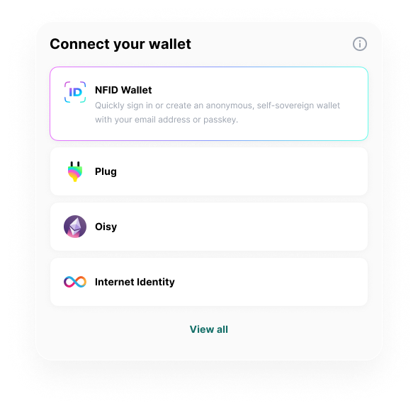
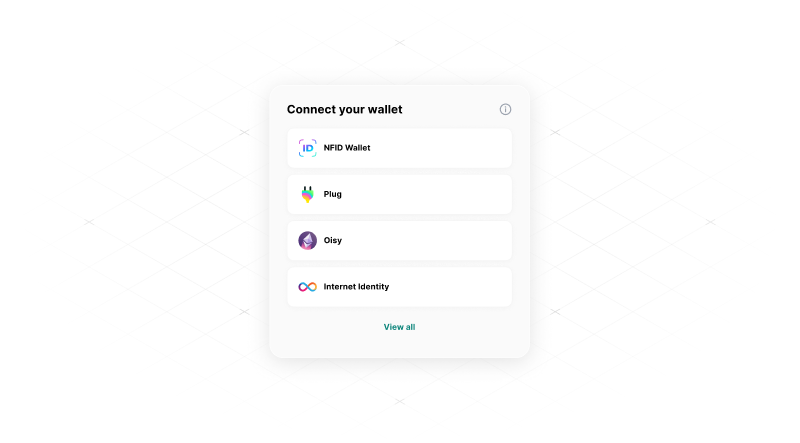

# Featured vs Compact mode

By default, IdentityKit's `modalMode` is set to `featured` (and looks like this):



```typescript
import { IdentityKitProvider } from '@nfid/identitykit';

export const App = () => (
  <IdentityKitProvider
    modalMode="featured"
    featuredWallet="nfidWallet"
    {...etc}
  >
    {/* Your App */}
  </IdentityKitProvider>
);
```

Available options for `featuredWallet`:

- `nfidWallet`

We also provide a compact mode, which looks like this:



To set your modal size to `compact`, just add `modalMode="compact"` as a prop in your
IdentityKitProvider:

```typescript
import { IdentityKitProvider } from '@nfid/identitykit';

export const App = () => (
  <IdentityKitProvider
    modalMode="compact"
    {...etc}
  >
    {/* Your App */}
  </IdentityKitProvider>
);
```
