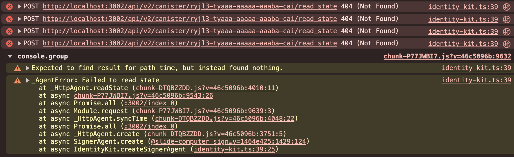

# Local Development

For making canister calls to local replica you need to have dfx running, and url of local replica
(will be printed to console on dfx start). All of the agents from
[exuting-canister-calls-example](/guides/executing-canister-calls#3-set-up-agents) should be created
with `host=http://localhost:{your_dfx_local_replica_port}`. Note agent retrived from
`useIdentityHook()` is using global network host by default, so in order to use it with local
replica you need to create own agent and pass it to `IdentityKitProvider` via props. See
[advanced-options](/getting-started/advanced-options#agent).

## Troubleshooting

In case of not running local replica and not using it's url as a host for agents you will see 404
requests to ledger canister with retries (only in local development). That is because `dfinity`
HttpAgent tries to fetch root key with few retries and by default will try to fetch it from your
application url as well as canister calls.

